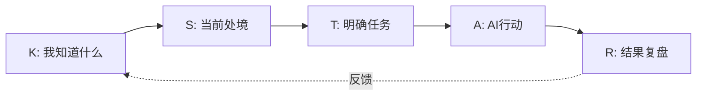

# AI+X 精英20班 学习作品集

> 从零到一，我如何与 AI 协作，在两周内完成从环境配置到产出三件作品的心路历程。

[](LICENSE)
[](https://github.com/cx677/elite20-my-work/commits/main)

## 📖 项目概览

这个仓库记录了我参与 **SIAS AI+X 精英20班** 前两周课程的全部学习成果。这是一个为混合专业背景（非计算机专业基础）的学生设计的课程，旨在通过“Vibe-Coding”（一种与AI即兴协作的编程方式），帮助大家建立与AI协作的基础能力。

在这两周里，我从一个AI协作的新手，逐步成长为一个能够独立使用AI工具、并总结出一套个人工作流的实践者。

## 📁 仓库结构

```
elite20-my-work/
├── artifact/                      # D5: 作品集 - 教育数字人大赛计划书
│   ├── artifact_output.md         # 最终产出的计划书
│   └── artifact_trace.md          # 从0到1的创作过程记录
├── kstar/                         # D6-D7: K-S-T-A-R 循环实践
│   ├── D6_KST_plan.md             # K, S, T (知识、情境、任务) 规划
│   └── D7_AR_result.md            # A, R (行动、结果) 执行与复盘
├── skills-output/                 # D4: 技能调用实践
│   └── D4_skill_output.md         # 调用翻译技能的输出与关键词提取
├── coordinate-card.md             # D8: AI+X 3D坐标卡
└── demo-script.md                 # D10: 3分钟成果展示演讲稿
```

## 🔧 核心实践与反思

### 1. 一次完整的 K-S-T-A-R 循环

我尝试将一次与AI的协作，拆解为可复用的五步流程，并通过文档记录整个过程。这帮助我更好地理解自己的需求，并能清晰地评估AI的输出。



### 2. 调用技能 (Skill)

我尝试调用了一个预置的翻译技能，完成了对英文内容的翻译和关键词提取，并记录了完整的过程和产出。这让我体会到，技能是将AI能力模块化、标准化的有效方式。

### 3. 定位自我：AI+X 3D坐标卡

通过填写坐标卡，我尝试从**自己的专业问题(X)**、**使用的AI工具栈(AI-Tooling)** 和**个人的成长反思(Self)** 三个维度，来定位自己当前的学习阶段和未来方向。

## 💡 艰难时刻与经验总结

在我的[3分钟展示脚本](https://github.com/cx677/elite20-my-work/blob/main/demo-script.md)中，我详细分享了两点核心经验：
1.  **明确的指令是关键**：AI的输出质量，高度依赖于我输入的清晰度。我发现，将任务拆解为“做什么、怎么验收、格式是什么”三个部分非常有效。
2.  **过程是最好的学习**：在处理文件编码问题时遇到的挫折，让我对“电脑如何处理中文”这类底层问题有了更直观的理解，这是单纯追求结果无法获得的收获。

## 🚀 下一步计划

1.  在项目开始前就明确自己的“坐标卡”，让AI协作更具方向性。
2.  每次与AI对话前，花费30秒明确最终的输出格式和验收标准。

## 📜 许可

MIT License
